# jt_mile 要件・DB・API設計レビュー報告書

> 対象: `docs/requirements/` 配下の要件定義書、DB設計書、API設計書、および本レビュー資料  
> 目的: 現状設計の課題を、初心者にも分かる形で整理し、何が問題で、どの設計アンチパターンに該当し、どの資料のどの記述を見直すべきかを明確にする

---

## 1. エグゼクティブサマリ

現行設計は、マイル比較サービスの初期構成として、画面構成・基本的なDB・API設計が整理されています。

一方で、実際にユーザーが「自分の保有マイルを最もお得に使う」サービスとして運用するには、重要な前提が不足しています。

特に大きい問題は、以下の11点です。

| # | 課題 | 初心者向けに言うと | 代表的なアンチパターン |
|---|---|---|---|
| 1 | 複数マイルを正しく扱えない | ANAマイルとJALマイルを、同じ財布のお金のように足している | Domain Model Mismatch（ドメインモデルの不一致） |
| 2 | 「最もお得」の基準がない | 何をもって1位にするか決まっていない | Ambiguous Business Rule（曖昧な業務ルール） |
| 3 | 提携発券を表現できない | 「どのマイルで、どの航空会社に乗れるか」がDBにない | Oversimplified Data Model（単純化しすぎたデータモデル） |
| 4 | ユーザー別管理がない | 毎回入力が必要で、自分専用の比較ができない | Retention-Hostile UX（継続利用しにくいUX） |
| 5 | 管理画面・運用設計がない | データを誰がどう更新するか決まっていない | Operational Blind Spot（運用設計の見落とし） |
| 6 | データ有効日と画面間の整合性が弱い | 比較画面と詳細画面で別の数字が出る可能性がある | Dual Source of Truth（二重の真実源） |
| 7 | 日次バッチの更新戦略が未定義 | 毎日どこまで・どの順で更新するか決まっていない | Undefined Refresh Strategy（更新戦略の未定義） |
| 8 | セキュリティ・権限管理が不足している | 見せてはいけない情報まで外部から見える可能性がある | Overexposed Database（DBの過剰公開） |
| 9 | 空港プルダウンのデータ取得方針が未定義 | 空港選択の動作が重くなるか、毎回API呼び出しになるか決まっていない | Undefined Fetch Strategy（取得戦略の未定義） |
| 10 | 会員機能・ユーザー認証をMVPに含めるか判断が必要 | ユーザー別にマイルを保存する価値を出すなら、会員機能なしでは足りない | Scope Inconsistency（スコープの不整合） |
| 11 | DB制約・時刻型の不備がある | タイムゾーンのズレやデータ不整合がデプロイ後に発覚しやすい | Missing DB Constraints（制約設計の不足） |

そのため、今後の設計方針としては、単なる比較サイトではなく、**ユーザーごとのマイル最適化サービス** として拡張することを推奨します。


---

## 2. この資料の読み方

この資料では、各課題を以下の型で整理しています。

| 項目 | 説明 |
|---|---|
| 何が問題か | 設計上の問題を短く説明します |
| 初心者向け説明 | 技術に詳しくない方でも分かるように例えで説明します |
| アンチパターン | ソフトウェア設計でよくないとされる典型パターン名を示します |
| 元資料の根拠 | どのドキュメントのどの記述が問題につながっているかを示します |
| どうするべきか | 設計・機能として何を追加または修正すべきかを示します |

### このレビュー書だけで何が分かるようになるか

このレビュー書は、単に「ここが悪い」と指摘するための資料ではありません。先方のお客様が、要件定義書・仕様書・DB設計書・API設計書を読むときに、**どの観点で読むべきか**を理解できるようにするための補助資料です。

特に、以下の読み方ができるようになることを目的にしています。

| 読めるようになること | 具体的に見られるようになるポイント |
|---|---|
| 要件定義書の読み方 | 「実現したい価値」と「実装する機能」がつながっているかを確認できる |
| 仕様書の読み方 | 画面に表示される文言・ボタン・バッジの裏に、どの判断ルールが必要かを確認できる |
| DB設計書の読み方 | 現実の業務ルールが、テーブル・カラム・リレーションで正しく表現されているかを確認できる |
| API設計書の読み方 | 画面に必要なデータが、APIレスポンスとして過不足なく返るかを確認できる |
| 運用設計の読み方 | リリース後に、誰が・いつ・どのデータを更新し、失敗時にどう対応するかを確認できる |

つまり、このレビュー書を読むことで、仕様書や要件定義書を「文章として読む」だけでなく、**その記述が実際の画面・DB・API・運用にどう影響するか**を追えるようになります。

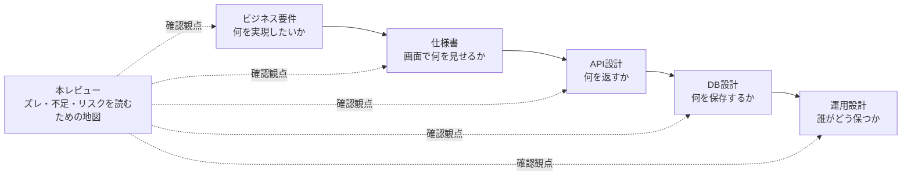

### 根拠の追い方

各課題の「元資料の根拠」では、指摘がどのドキュメントのどの記述から来ているかを示しています。読み手は、まず本レビューの課題説明を読み、その後に元資料へ戻ることで、設計書のどの部分を修正すべきかを確認できます。

| 読む順番 | 読むもの | 確認すること |
|---:|---|---|
| 1 | 本レビューの「何が問題か」 | 指摘の結論を把握する |
| 2 | 本レビューの「初心者向け説明」 | 非エンジニアでも分かる例で理解する |
| 3 | 本レビューの「元資料の根拠」 | どの設計書のどの記述が原因かを確認する |
| 4 | 元の要件・仕様・DB・API設計書 | 実際に修正すべき箇所を確認する |
| 5 | 本レビューの「どうするべきか」 | 修正方針を決める |

---

## 3. アンチパターン早見表

アンチパターンとは、**一見よさそうに見えるが、後から問題を起こしやすい設計・実装の典型例** のことです。

この資料では、各課題を理解しやすくするために、以下のアンチパターン名を使っています。英語名だけでは分かりにくいため、日本語名と簡単な説明を併記します。

### アンチパターン早見表の使い方

この表は、技術用語を覚えるためではなく、**なぜその指摘が重要なのかを短時間で判断するための表**です。

例えば、「Domain Model Mismatch」と書かれている指摘は、単なる画面文言の修正ではなく、DBやAPIの前提そのものが現実の業務とズレている可能性があります。一方で、「Undefined Fetch Strategy」は、データ取得方法を明文化すれば解消できる可能性が高い指摘です。

| 分類 | 英語名 | 日本語での読み方 | 簡単な意味 | 今回の例 | 主に確認する資料 |
|---|---|---|---|---|---|
| 業務ルール | Domain Model Mismatch（ドメインモデルの不一致） | ドメインモデルの不一致 | 現実の業務ルールと、システム上のデータ構造がズレている状態 | ANAマイルとJALマイルを1つの保有マイルとして扱う | ビジネス要件、DB設計 |
| 業務ルール | False Aggregation（誤った合算） | 誤った合算 | 本来足してはいけない値を、1つの合計値として扱ってしまう状態 | 複数マイルを合計80,000マイルとして扱う | ペルソナ、データ一覧、API設計 |
| 判断ロジック | Ambiguous Business Rule（曖昧な業務ルール） | 曖昧な業務ルール | 重要な判断基準が決まっていない状態 | 「最もお得」の計算式がない | ビジネス要件、仕様書 |
| 判断ロジック | Hidden Decision Logic（隠れた判断ロジック） | 隠れた判断ロジック | 設計書に書くべき判断基準が、実装者の判断に任されている状態 | BESTバッジの判定根拠がない | 仕様書、API設計 |
| データモデル | Oversimplified Data Model（単純化しすぎたデータモデル） | 単純化しすぎたデータモデル | 複雑な業務を、単純すぎるDB構造で表そうとしている状態 | 発券プログラムと運航会社を分けていない | DB設計、データ一覧 |
| データモデル | Missing Relationship（関係性の欠落） | 関係性の欠落 | 本来DBで表現すべき関係が抜けている状態 | マイレージプログラムと提携航空会社の関係がない | DB設計 |
| UX | Retention-Hostile UX（継続利用しにくいUX） | 継続利用しにくいUX | 何度も使ってほしいのに、再訪時の手間が大きい状態 | 毎回マイル残高を入力する必要がある | ジャーニー、仕様書 |
| UX | Stateless Personalization Failure（個別最適化できない設計） | 個別最適化できない設計 | ユーザーごとの最適化が必要なのに、ユーザー情報を保存しない状態 | ユーザー別マイル残高を保存できない | 仕様書、DB設計 |
| 運用 | Operational Blind Spot（運用設計の見落とし） | 運用設計の見落とし | リリース後に誰がどう運用するかが決まっていない状態 | データ更新担当者・管理画面が未定義 | API設計、運用方針 |
| 運用 | Manual DB Operation（DB直接運用） | DB直接運用 | 管理画面がなく、DBを直接編集して運用する危険な状態 | マイル表を手作業でDB更新する可能性 | DB設計、運用方針 |
| 運用 | No Audit Trail（監査ログ不足） | 監査ログ不足 | 誰がいつ何を変更したか追跡できない状態 | 更新履歴が不十分 | DB設計、管理画面仕様 |
| データ鮮度 | Temporal Logic Omission（時制ロジックの欠落） | 時制ロジックの欠落 | 有効日・期限があるデータなのに、どの時点のデータを使うか決めていない状態 | 最新のマイル表取得条件がない | DB設計、API設計 |
| データ鮮度 | Dual Source of Truth（二重の真実源） | 二重の真実源 | 同じ情報を複数箇所で別々に計算し、数字がズレる状態 | 比較画面と詳細画面で別々に必要マイルを取得する | API設計、仕様書 |
| データ鮮度 | Stale or Future Data Leak（古い・未来データの誤表示） | 古い・未来データの誤表示 | 古いデータや、まだ適用前の未来データを誤って表示する状態 | 将来改定予定のマイル数を先に表示する | DB設計、API設計 |
| セキュリティ | Overexposed Database（DBの過剰公開） | DBの過剰公開 | 本来見せる必要がないDB情報まで外部に見えている状態 | SupabaseでRLSなしの公開 | DB設計、API設計 |
| セキュリティ | Missing Authorization Boundary（権限境界の欠落） | 権限境界の欠落 | 一般ユーザー・ログインユーザー・管理者の権限差が曖昧な状態 | 管理APIや管理画面の権限設計が弱い | API設計、管理画面仕様 |
| セキュリティ | Sensitive Link Exposure（重要URLの露出） | 重要URLの露出 | 収益や管理に関わるURLを直接公開してしまう状態 | affiliate_urlを通常テーブルに持つ | DB設計、API設計 |

### 技術キーワード解説

以下は、このレビューで何度も出てくる重要語です。非エンジニアの方が設計書を読むときは、まずこの表を参照してください。

| 用語 | 意味 | なぜ重要か |
|---|---|---|
| 要件定義 | サービスとして何を実現するかを決める文書 | ここが曖昧だと、画面・DB・APIが別々の解釈で作られる |
| 仕様書 | 画面や操作、表示内容を具体化する文書 | ボタン・バッジ・エラー表示など、ユーザーに見える動作を決める |
| DB設計 | 保存するデータと関係性を決める設計 | 現実のルールを正しく保存できないと、後から画面だけ直しても解決しない |
| API設計 | 画面とDBの間で受け渡すデータを決める設計 | 画面に必要な情報が返らないと、正しい表示や判定ができない |
| マイレージプログラム | ANAマイレージクラブ、JALマイレージバンクなど、マイルを貯めて使う単位 | 航空会社そのものとは別に扱わないと、提携発券や複数マイル比較ができない |
| 運航航空会社 | 実際に飛行機を運航する会社 | 「乗る会社」と「マイルを使う会社」が違うケースを表現するために必要 |
| RLS | Row Level Securityの略。DBの行単位で閲覧・更新権限を制御する仕組み | Supabase等で、ユーザーが見てよいデータだけを見せるために重要 |
| `timestamptz` | タイムゾーンを含むPostgreSQLの時刻型 | 日本時間・UTCのズレによるデータ不整合を防ぐ |
| `effective_from` | データの適用開始日 | マイル表や料金改定で、どの日付のデータを使うか判断するために必要 |
| `data_version` | 比較結果と詳細画面で同じデータを参照するための版番号 | 画面間で数字がズレる問題を防ぐ |

---

## 4. レビュー対象と観点

### レビュー対象

- `docs/requirements/business-requirements/business-requirements.md`
- `docs/requirements/personas/*.md`
- `docs/requirements/journey/journey.md`
- `docs/requirements/specifications/*.md`
- `docs/requirements/requirements-v1/*.md`
- `docs/requirements/requirements-v2/*.md`
- `docs/requirements/ipo/ipo.md`
- `docs/requirements/data/data-list.md`
- `docs/requirements/database/database-design.md`
- `docs/requirements/api/api-design.md`
- `review/client-review-summary.md`

### レビュー観点

| 観点 | 確認内容 |
|---|---|
| ビジネス要件 | サービスの目的と機能設計が一致しているか |
| ユーザー体験 | 実際の利用シーンで不自然な点がないか |
| DB設計 | 現実のマイル制度を正しく表現できているか |
| API設計 | 比較結果を正しく・安定して返せるか |
| 運用 | データ更新・管理・監査が可能か |
| セキュリティ | 公開すべきでない情報が漏れないか |

---

## 5. 全体評価

### 良い点

- P001〜P007までの画面構成が整理されている
- 発券機能を持たず、公式サイトへの外部遷移に限定している点は妥当
- リアルタイム空席検索をスコープ外にしており、MVP範囲を抑えている
- DB設計・API設計の初期たたき台が存在している
- 本レビューで主要な懸念点を横断的に整理している

### 主な課題

- 複数のマイルプログラムを正しく扱えない
- ユーザー別にマイル残高を管理できない
- 「最もお得」の判定ロジックが未定義
- 提携発券やアライアンス発券の考慮が不足している
- データ更新運用と管理画面が未定義
- セキュリティ・権限設計に追加検討が必要

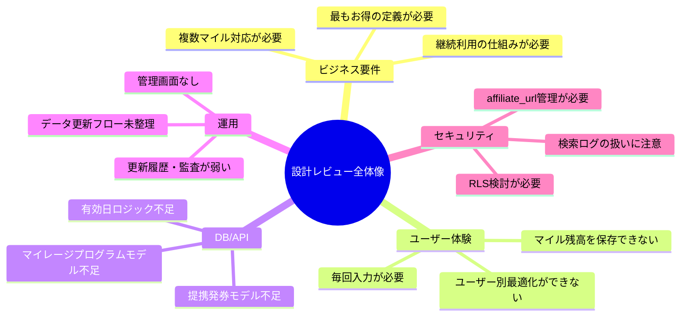

---

## 6. 課題別の根拠対応表

以下の表は、各指摘がどのドキュメントのどの部分に基づいているかをまとめたものです。詳細な説明は各課題の「元資料の根拠」に記載していますが、まず全体像を把握する場合はこの表から確認してください。

| 課題 | 主に確認するドキュメント | 確認すべき部分 | 読み取れること |
|---|---|---|---|
| 課題1: 複数マイルを正しく扱えない | `personas/individual-traveler.md`、`requirements-v2/P002-compare-result.md`、`data-list.md`、`database-design.md` | `ANA / JAL 合計`、`owned_miles`、`search_owned_miles`、`search_logs.owned_miles` | 複数マイルを想定している一方、設計は単一マイル入力になっている |
| 課題2: 「最もお得」の判定基準が未定義 | `business-requirements.md`、`specifications/P002-compare-result.md`、`api-design.md` | `最もお得`、`BESTバッジ`、`is_best`、`sort` | 画面・APIに判定結果はあるが、判定式が定義されていない |
| 課題3: 提携発券モデルが不足 | `database-design.md`、`journey.md`、`data-list.md` | `mileage_charts`、`mileage_program_name`、スターアライアンス各社比較 | 運航会社と発券プログラムを分ける必要がある |
| 課題4: ユーザー別管理がない | `specifications/flow.md`、`data-list.md`、`journey.md` | `会員機能は持たない`、`保有マイルもURLパラメータ／クライアント側のみ`、`再訪` | 継続利用の期待と、保存しない設計がズレている |
| 課題5: 管理画面・運用設計がない | `api-design.md`、`database-design.md` | `/api/admin/data-refresh`、`data_update_logs`、`スクレイピング／手動入力` | バッチ起動や更新日時はあるが、失敗時の運用手順が不足している |
| 課題6: データ有効日と画面間整合性が弱い | `database-design.md`、`api-design.md` | `effective_from`、`applied_from`、`/api/compare`、`/api/airlines/{airline_id}/detail` | 比較画面と詳細画面で、同じ時点のデータを見る保証が弱い |
| 課題7: 日次バッチ戦略が未定義 | `data-list.md`、`api-design.md`、`business-requirements.md` | `日次バッチ`、`/api/admin/data-refresh`、`主要30社` | 毎日どの範囲を更新するのかが未定義 |
| 課題8: セキュリティ・権限管理が不足 | `api-design.md`、`database-design.md` | `公開API`、`affiliate_url`、管理API | 公開範囲、管理者権限、収益URLの扱いを分ける必要がある |
| 課題9: 空港プルダウン取得方針が未定義 | `api-design.md`、`specifications/P001-home.md` | `/api/airports`、出発地・目的地セレクタ | 全件取得か検索型取得かが未定義 |
| 課題10: 会員機能・ユーザー認証をMVPに含めるかの判断 | `specifications/flow.md`、`personas/individual-traveler.md`、`journey.md` | `会員機能は持たない`、`ANA/JAL合算` | ユーザー別のマイル管理を価値にするなら、会員機能・認証を入れる判断が必要 |
| 課題11: DB制約・時刻型の不足 | `database-design.md` | `timestamp`、`updated_at DEFAULT now()`、`cabin_class`、`routes.is_direct` | デプロイ前に型・制約・更新トリガーを補う必要がある |

この対応表により、先方は「レビューで指摘された内容が、元の設計書のどこから読み取れるのか」を確認できます。設計書を修正するときは、該当するドキュメントだけでなく、関連する上流・下流ドキュメントも一緒に更新することが重要です。

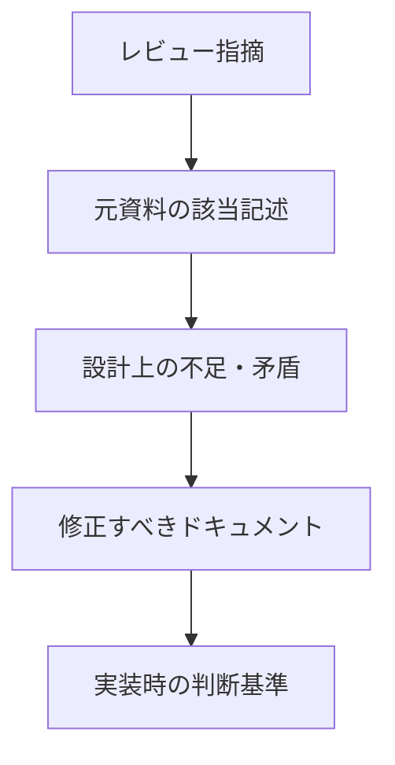

---

## 課題1: 複数マイルを正しく扱えない

### 何が問題か

現行設計では、ユーザーが入力する保有マイルを `owned_miles` という単一の数値として扱っています。

しかし実際には、ANAマイル、JALマイル、KrisFlyerなどは別々のマイルプログラムです。単純に合算して、すべての航空会社に使えるわけではありません。

### 初心者向け説明

これは、日本円、米ドル、ユーロを全部足して「合計10万円分あります」と言っているようなものです。

通貨ごとに使える場所や価値が違うため、単純に足すと間違った判断になります。マイルも同じで、ANAマイルとJALマイルは別物です。

### 現状の問題イメージ

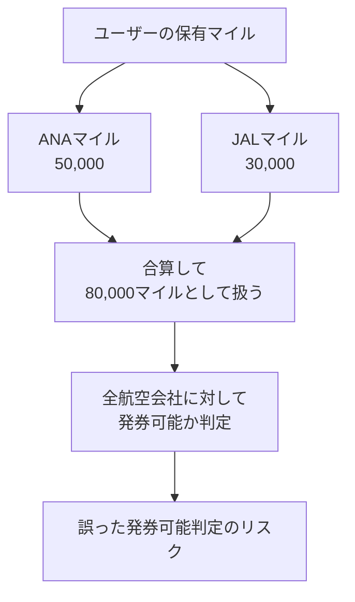

### アンチパターン

| アンチパターン | 内容 |
|---|---|
| Domain Model Mismatch（ドメインモデルの不一致） | 現実世界のルールを、システムのデータ構造が正しく表現できていない状態 |
| False Aggregation（誤った合算） | 本来は合算してはいけない値を、1つの数値として足してしまう状態 |

このケースでは、「マイルはプログラムごとに別物」という業務ルールを、`owned_miles` という1つの数値に押し込めていることが問題です。

### 元資料の根拠

| 元資料 | 該当記述 | なぜ問題か |
|---|---|---|
| `docs/requirements/personas/individual-traveler.md` | `ANA / JAL 合計で約8万マイル保有` | 複数マイル保有を想定している |
| `docs/requirements/requirements-v2/P002-compare-result.md` | `owned_miles+各行mileage_required` で比較 | 1つの保有マイルを全航空会社に当てている |
| `docs/requirements/data/data-list.md` | `search_owned_miles` が数値1項目 | マイルプログラム別に分かれていない |
| `docs/requirements/database/database-design.md` | `search_logs.owned_miles int` | 検索ログも単一マイル前提になっている |

### どうするべきか

複数マイルを利用する前提であれば、保有マイルを単一数値ではなく、**マイレージプログラム別** に管理する必要があります。

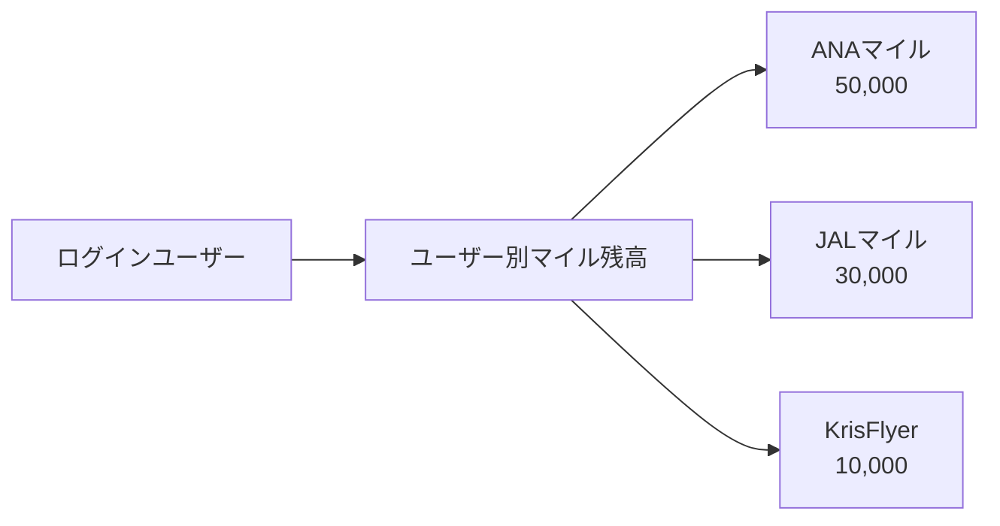

追加・修正すべき設計は以下です。

| 対応 | 内容 |
|---|---|
| `mileage_programs` を追加 | ANAマイレージクラブ、JALマイレージバンク等を管理する |
| `user_mile_balances` を追加 | ユーザーごと・マイレージプログラムごとの保有マイルを管理する |
| P001検索条件を修正 | 単一の保有マイル入力ではなく、ログインユーザーの保有マイルを参照する |
| P002比較ロジックを修正 | マイレージプログラムごとに発券可否を判定する |

---

## 課題2: 「最もお得」の判定基準が未定義

### 何が問題か

現行設計では、「マイル数 + 現金費用」で比較するとされていますが、どの条件をもって「最もお得」とするかが明確ではありません。

### 初心者向け説明

例えば、次の2つがある場合、どちらがお得でしょうか。

- A社: 60,000マイル + 現金50,000円
- B社: 80,000マイル + 現金10,000円

現金を節約したい人にはB社がお得です。マイルを節約したい人にはA社がお得です。

つまり、「お得」の意味を決めないと、システムは正しい1位を決められません。

### 判定が分かれる例

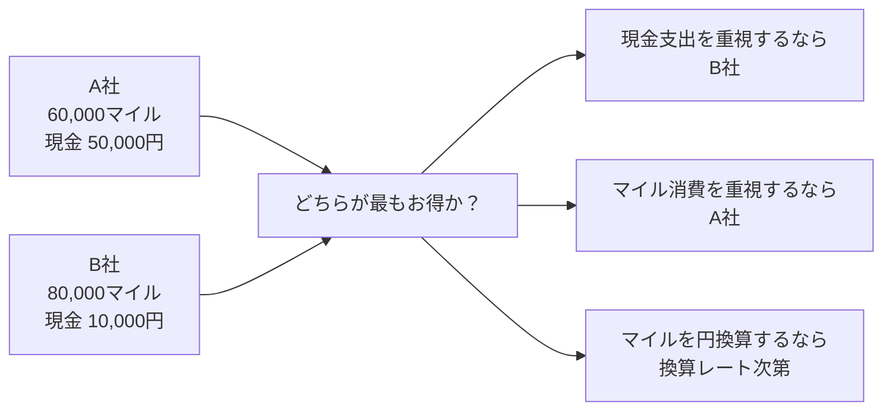

### アンチパターン

| アンチパターン | 内容 |
|---|---|
| Ambiguous Business Rule（曖昧な業務ルール） | 業務ルールが曖昧なまま実装に進む状態 |
| Hidden Decision Logic（隠れた判断ロジック） | 重要な判断基準が設計書に書かれず、実装者の判断に任される状態 |

### 元資料の根拠

| 元資料 | 該当記述 | なぜ問題か |
|---|---|---|
| `docs/requirements/business-requirements/business-requirements.md` | `マイル数 ＋ 現金費用で各航空会社を一括比較` | 比較するとは書いているが、判定式がない |
| `docs/requirements/specifications/P002-compare-result.md` | `最もお得な航空会社を一目で判断` | 「最もお得」の基準が未定義 |
| `docs/requirements/specifications/P002-compare-result.md` | `BESTバッジ` | BESTを付ける計算根拠がない |
| `docs/requirements/api/api-design.md` | `is_best` をレスポンスに含める | APIがBESTを返すが、判定ロジックが未定義 |

### どうするべきか

「最もお得」の判定基準を明文化する必要があります。

| 判定基準 | 内容 | 向いているケース |
|---|---|---|
| 現金支出最小 | 燃油サーチャージ・諸税の合計が最も低いものを優先 | 手出し金額を抑えたいユーザー |
| 必要マイル最小 | 消費マイルが最も少ないものを優先 | マイルを温存したいユーザー |
| 総合コスト最小 | マイルを円換算し、現金支出と合算して比較 | 最も合理的な比較をしたい場合 |

推奨は **総合コスト最小** です。

ただし、マイルの円換算レートを固定するのか、ユーザーが設定できるようにするのかは検討が必要です。

---

## 課題3: 提携発券・アライアンス発券のモデルが不足している

### 何が問題か

現行DBでは、必要マイル数を以下のように管理しています。

```text
航空会社 × 路線 × クラス = 必要マイル
```

しかし実際には、必要マイル数は「どのマイレージプログラムで発券するか」によって変わります。

### 初心者向け説明

飛行機に乗る会社と、マイルを使う会社は必ずしも同じではありません。

例えば、ANAマイルを使って、同じスターアライアンスのルフトハンザ便に乗れる場合があります。この場合、運航する会社はルフトハンザでも、使うマイルはANAマイルです。

現行設計では、この違いを十分に表現できません。

### アンチパターン

| アンチパターン | 内容 |
|---|---|
| Oversimplified Data Model（単純化しすぎたデータモデル） | 複雑な業務ルールを単純すぎるデータ構造で表現してしまう状態 |
| Missing Relationship（関係性の欠落） | 本来必要な関係性がDBに存在しない状態 |

### 元資料の根拠

| 元資料 | 該当記述 | なぜ問題か |
|---|---|---|
| `docs/requirements/database/database-design.md` | `mileage_charts` が `airline_id`, `route_id`, `cabin_class` で必要マイルを管理 | 発券に使うマイレージプログラムがない |
| `docs/requirements/personas/jt-employee.md` | `スターアライアンス各社の特典航空券` | 提携発券を想定している |
| `docs/requirements/journey/journey.md` | `ANA/LH/SWISS等のトータルコストを比較` | 運航会社と発券プログラムの区別が必要 |
| `docs/requirements/data/data-list.md` | `mileage_program_name` は航空会社の属性として保持 | 独立したマイレージプログラムとして扱っていない |

### どうするべきか

以下のように、マイレージプログラム、運航航空会社、路線、必要マイル表を分けて設計するべきです。

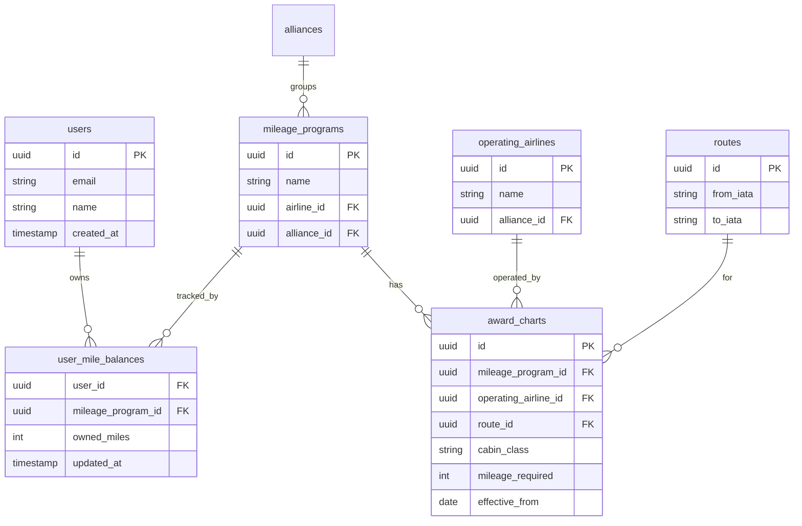

この設計にすると、ユーザーが複数のマイルを持っている場合でも、どのマイルでどの航空会社を発券できるかを正しく比較できます。

---

## 課題4: ユーザーごとのマイル管理ができない

### 何が問題か

現行設計では、会員機能を持たない前提になっています。そのため、ユーザーごとにマイル残高を保存できません。

### 初心者向け説明

毎回、同じプロフィール情報を入力させるサービスは使い続けにくくなります。

マイル残高は頻繁に変わるものではないため、一度登録しておけば、次回以降はその情報を使って比較できる方が自然です。

### アンチパターン

| アンチパターン | 内容 |
|---|---|
| Retention-Hostile UX（継続利用しにくいUX） | 継続利用してほしいのに、再訪時の手間を減らす仕組みがない状態 |
| Stateless Personalization Failure（個別最適化できない設計） | ユーザーごとの最適化が必要なのに、ユーザー情報を保存しない状態 |

### 元資料の根拠

| 元資料 | 該当記述 | なぜ問題か |
|---|---|---|
| `docs/requirements/specifications/flow.md` | `会員機能は持たない` | ユーザー別の保存ができない |
| `docs/requirements/specifications/flow.md` | `検索履歴・お気に入り保存は持たない` | 継続利用の仕組みがない |
| `docs/requirements/data/data-list.md` | `保有マイルもURLパラメータ／クライアント側のみ` | サーバー側にユーザー情報を保存しない |
| `docs/requirements/journey/journey.md` | `次回旅行時にも再訪` | 継続利用の期待と設計がズレている |

### どうするべきか

ユーザー認証機能を導入し、ユーザーごとにマイル残高を管理できるようにすることを推奨します。

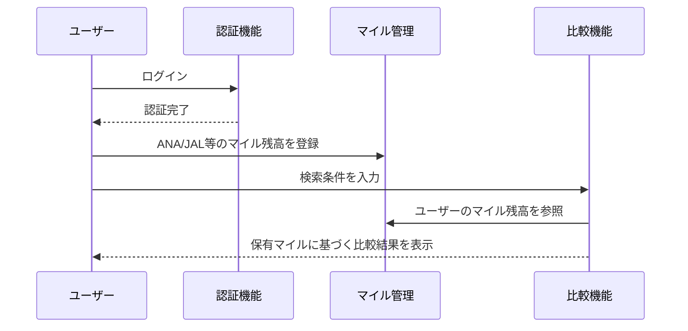

必要な機能は以下です。

| 機能 | 内容 |
|---|---|
| ユーザー認証 | メール、Googleログイン等でユーザーを識別する |
| マイル残高登録 | ANA/JAL/KrisFlyer等の残高を保存する |
| マイページ | 登録済みマイルや検索条件を確認できる |
| ユーザー別比較 | 保存済みマイルをもとに比較結果を出す |

---

## 課題5: 管理画面・運用設計が未定義

### 何が問題か

このサービスでは、マイル表・燃油サーチャージ・クレジットカード情報など、定期的に更新が必要なデータを扱います。

現行設計では、日次バッチや手動入力の記載はありますが、取得失敗時に誰が何を確認し、どう対処するかが設計されていません。管理画面が必要かどうか自体も、まだ判断されていない状態です。

### 初心者向け説明

比較サイトは、表示するデータが間違っていると信用されません。

バッチ失敗やデータ異常が起きたとき、「誰が・何を使って・どう対処するか」が決まっていないと、担当者がDBを直接編集する運用になりがちです。これはミスが起きやすく、変更履歴も残りません。

管理画面を作るかどうかは、**運用をどう回すか**を決めてから判断する必要があります。

### アンチパターン

| アンチパターン | 内容 |
|---|---|
| Operational Blind Spot（運用設計の見落とし） | 運用時に誰が何をするかが設計されていない状態 |
| Manual DB Operation（DB直接運用） | バッチ失敗時や例外対応で、DBを直接触って運用する状態 |
| No Audit Trail（監査ログ不足） | 誰がいつ何を変更したか追跡できない状態 |

### 元資料の根拠

| 元資料 | 該当記述 | なぜ問題か |
|---|---|---|
| `docs/requirements/api/api-design.md` | `データソースはスクレイピング／手動入力` | 実際の運用手順が未定義 |
| `docs/requirements/api/api-design.md` | `運用詳細はSprint 2以降で詳細化` | 現時点では運用設計が不足 |
| `docs/requirements/database/database-design.md` | `data_update_logs` はある | 更新日時は記録できるが、失敗時の確認・復旧・表示制御の設計がない |

### 先に確認すべきこと

管理画面の要否を判断する前に、以下の運用方針を確認する必要があります。

| 確認事項 | なぜ必要か |
|---|---|
| バッチ失敗時に誰が対応するか | 担当者・連絡手段・対応手順が決まっていないと運用できない |
| 失敗時に前回値を表示するか、非表示にするか | ユーザーに誤った情報を出し続けないための判断が必要 |
| データが何日古くなったら表示しないか | 鮮度の基準が決まっていないと、古いデータを出し続けるリスクがある |
| アフィリエイトURLや提携情報を誰がどう更新するか | 手動管理が発生するなら、DB直接編集以外の手段が必要 |
| 更新履歴・変更ログを残す必要があるか | 監査・障害対応・ミス追跡のために必要かを判断する |

### 管理画面が必要になるケース

上記を確認した結果、以下のいずれかに該当する場合は、管理画面（または運用コンソール）の導入が妥当です。

| 条件 | 理由 |
|---|---|
| バッチ失敗を非エンジニアが対応する | DBに直接アクセスできない担当者が操作できる画面が必要 |
| 手動でデータを修正・再取得する運用が発生する | DBを直接編集する運用はミスが起きやすく、履歴も残らない |
| アフィリエイトURLなど手動管理データがある | 安全に更新・確認できる画面が必要 |
| 表示/非表示を柔軟に制御したい | 問題のある航空会社を一時的に非表示にするような操作が必要 |

逆に、**エンジニアがバッチログを直接監視し、DB操作も許容する小規模運用であれば、MVPでは管理画面を省略することも選択肢に入ります。**

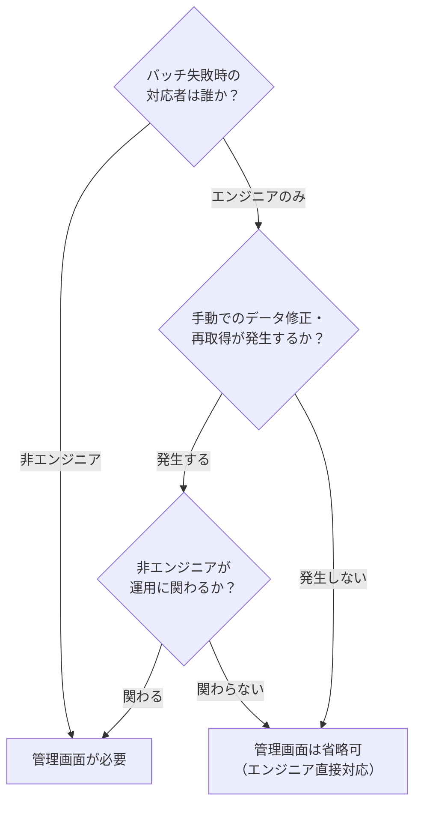

---

## 課題6: データ有効日と画面間の整合性が弱い

### 何が問題か

マイル数や燃油サーチャージは定期的に変わります。

そのため、DBに複数の履歴データが存在する場合、APIは「どの時点のデータを使うか」を明確に決める必要があります。

また、比較結果画面と詳細画面で別々にDBを読みに行くと、表示される数値がズレる可能性があります。

### 初心者向け説明

比較結果画面では「ANA 75,000マイル」と出ていたのに、詳細画面を開いたら「ANA 80,000マイル」と表示されたら、ユーザーはどちらを信じればよいか分からなくなります。

### アンチパターン

| アンチパターン | 内容 |
|---|---|
| Temporal Logic Omission（時制ロジックの欠落） | 日付や有効期限を持つデータなのに、どの時点のデータを使うか決めていない状態 |
| Dual Source of Truth（二重の真実源） | 同じ数字を複数箇所で別々に計算・取得し、結果がズレる状態 |
| Stale or Future Data Leak（古い・未来データの誤表示） | 古いデータや未来適用データを誤って表示する状態 |

### 元資料の根拠

| 元資料 | 該当記述 | なぜ問題か |
|---|---|---|
| `docs/requirements/database/database-design.md` | `mileage_charts.effective_from` | 有効開始日があるが取得ルールが必要 |
| `docs/requirements/database/database-design.md` | `fuel_surcharges.applied_from` | 燃油サーチャージにも有効開始日がある |
| `docs/requirements/api/api-design.md` | `/api/compare` | 有効レコードの取得条件が明記されていない |
| `docs/requirements/api/api-design.md` | `/api/airlines/{airline_id}/detail` | 比較結果とは別に再取得する設計 |

### 想定される問題

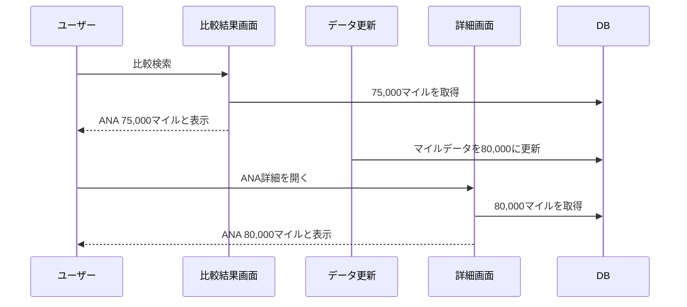

### どうするべきか

- `effective_from <= today` のうち最新のデータを使う
- 比較結果と詳細画面で同じ `data_version` を参照する
- 検索結果単位で `search_result_id` を発行し、同じ検索結果を再表示できるようにする
- 最終更新日をユーザー画面に明示する

---

## 課題7: 日次バッチの更新戦略が未定義

### 何が問題か

現行ドキュメントでは、マイル料金・燃油サーチャージは日次バッチで更新する想定になっています。

ただし、日次バッチで **毎日すべての航空会社・すべての路線・すべてのクラスを取得するのか**、それとも **対象を絞って更新するのか** が定義されていません。

### 初心者向け説明

「毎日データを更新する」と言っても、やり方はいくつかあります。

例えば、毎日すべての商品価格を調べる比較サイトもあれば、よく検索される商品だけ高頻度に更新し、あまり使われない商品は低頻度にするサイトもあります。

マイル比較でも同じで、全路線を毎日総当たりで取得すると、対象数が膨大になり、取得時間・失敗率・外部サイトへの負荷が大きくなる可能性があります。

### アンチパターン

| アンチパターン | 内容 |
|---|---|
| Undefined Refresh Strategy（更新戦略の未定義） | データをいつ・どの範囲で・どの優先度で更新するか決まっていない状態 |
| Full Scan Assumption（全件取得前提） | 実現可能性を検証せず、毎回すべてを取得する前提にしてしまう状態 |
| Cache Freshness Ambiguity（キャッシュ鮮度の曖昧さ） | どの程度古いデータまで表示してよいか決まっていない状態 |

### 元資料の根拠

| 元資料 | 該当記述 | なぜ問題か |
|---|---|---|
| `docs/requirements/data/data-list.md` | `マイル料金・燃油サーチャージは日次バッチで更新する想定` | 日次更新とはあるが、更新範囲が未定義 |
| `docs/requirements/api/api-design.md` | `cronで /api/admin/data-refresh を叩く想定` | バッチ起動方法はあるが、対象選定ロジックが未定義 |
| `docs/requirements/api/api-design.md` | `/api/compare` は5〜10分キャッシュ推奨 | キャッシュはあるが、元データの鮮度許容が未定義 |
| `docs/requirements/business-requirements/business-requirements.md` | `主要30社` | 30社対象でも、路線・クラス・期間の組み合わせは膨大になりうる |

### レビューとして確認すべきこと

この論点は、「この方式を選んでください」と決め打ちするのではなく、以下を先方と確認するべきです。

| 確認事項 | 確認の意図 |
|---|---|
| 日次バッチは全件取得を想定しているか | 取得量・実行時間・失敗率を見積もるため |
| MVP対象路線はどこまでか | 全路線ではなく、対象範囲を明確にするため |
| 人気路線を優先更新するか | ユーザー価値が高いデータを新しく保つため |
| 検索ログを更新優先度に使うか | よく検索される条件を重点的に更新するため |
| 取得失敗時に前回値を出すか | 比較結果を出し続けるか、誤表示を避けるかを決めるため |
| 何日以上古いデータを表示しないか | データ鮮度の基準を明確にするため |
| 画面にどのような注記を出すか | ユーザーに「参考値」であることを伝えるため |

### 比較サイトで一般的に使われる考え方

一般的な比較サイトでは、すべてを毎回リアルタイム取得するのではなく、データの性質に応じて取得頻度を分けることが多いです。

| データ | 変動頻度 | 取得方針として検討すべきこと |
|---|---:|---|
| 航空会社マスタ | 低い | 低頻度更新または手動メンテで足りるか |
| 空港マスタ | 低い | 静的マスタで足りるか |
| 路線マスタ | 中 | 対象路線を限定するか |
| 必要マイル数 | 中 | 日次・週次・改定時チェックのどれが妥当か |
| 燃油サーチャージ | 中 | 日次または数日単位の更新で足りるか |
| 空席・特典枠 | 高い | 現行スコープ外のままでよいか |

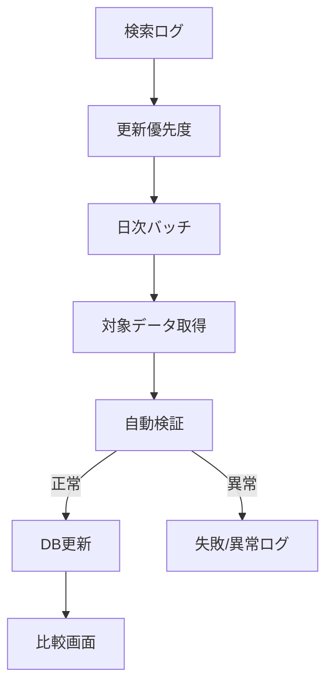

### どうするべきか

レビューとしては、以下を設計書に追記するよう促すのが適切です。

- 日次バッチの対象範囲
- 全件取得か、優先度更新か
- MVP対象路線・対象航空会社・対象クラス
- 取得失敗時の表示方針
- 前回値を使う場合の鮮度上限
- ユーザー画面に表示する最終更新日時と免責文

---

## 課題8: セキュリティ・権限管理が不足している

### 何が問題か

本レビューでは、RLSやアフィリエイトURLの扱いについても指摘しています。

特にSupabaseを利用する場合、DBの公開範囲や権限設定を誤ると、本来公開すべきでない情報が外部から参照される可能性があります。

### 初心者向け説明

DBはサービスの裏側にあるデータ倉庫です。

倉庫の入口に鍵がなかったり、誰でも全ての棚を見られる状態だと、見せてはいけない情報まで見えてしまいます。RLSや権限管理は、この入口や棚ごとの鍵にあたります。

### アンチパターン

| アンチパターン | 内容 |
|---|---|
| Overexposed Database（DBの過剰公開） | DBやAPIが必要以上の情報を外部に公開している状態 |
| Missing Authorization Boundary（権限境界の欠落） | 一般ユーザー、ログインユーザー、管理者の権限差が定義されていない状態 |
| Sensitive Link Exposure（重要URLの露出） | アフィリエイトURLなど管理すべき情報を直接公開してしまう状態 |

### 元資料の根拠

| 元資料 | 該当記述 | なぜ問題か |
|---|---|---|
| `docs/requirements/api/api-design.md` | 一般APIは公開API、認証なし | 公開範囲の整理が必要 |
| `docs/requirements/database/database-design.md` | `airlines.affiliate_url` | 収益関連URLが通常テーブルに同居している |
| `docs/requirements/database/database-design.md` | `credit_cards.affiliate_url` | クレカのアフィリエイトURLも同様 |

### どうするべきか

| 論点 | 推奨対応 |
|---|---|
| RLS | テーブルごとに読み取り・書き込みポリシーを定義する |
| affiliate_url | 直接返さず、API経由のリダイレクトに限定する |
| 管理画面 | 管理者ロールを設け、一般ユーザーと権限を分ける |
| 検索ログ | 保存期間、匿名化、利用目的を明記する |
| API Rate Limit | IP単位・ユーザー単位でアクセス制限を設定する |

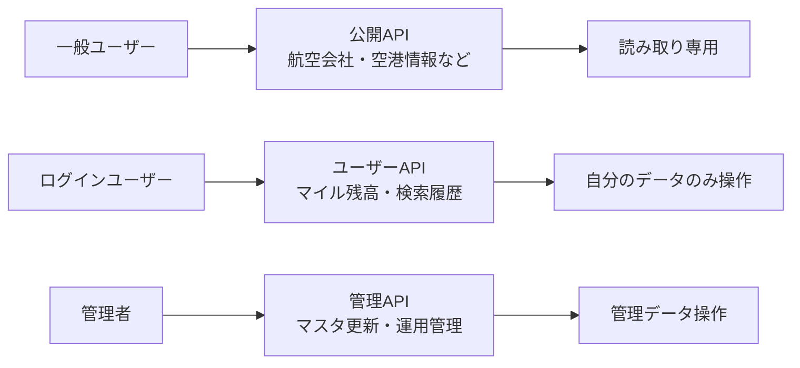

---

## 課題9: 空港プルダウンのデータ取得方針が未定義

### 何が問題か

P001の出発地・目的地セレクタは `GET /api/airports` を使う設計ですが、全件取得してクライアント側で絞り込むのか、入力ごとにAPI検索するのかが未定義です。

### 初心者向け説明

空港の一覧を画面に出す方法には「最初に全部読み込んでおく」方法と「文字を打つたびに検索する」方法があります。どちらにするかで、画面の重さやサーバーへの負荷が大きく変わります。決めずに作り始めると、リリース後に「重くて使いにくい」「サーバーに負荷がかかりすぎる」という問題が出やすくなります。

### アンチパターン

| アンチパターン | 内容 |
|---|---|
| Undefined Fetch Strategy（取得戦略の未定義） | データをどのように取得するかの方針が設計書に定義されていない状態 |

### 元資料の根拠

| 元資料 | 該当記述 | なぜ問題か |
|---|---|---|
| `docs/requirements/api/api-design.md` | `GET /api/airports` | 全件取得かインクリメンタルサーチかが未定義 |
| `docs/requirements/specifications/P001-home.md` | 出発地・目的地セレクタ | 動作方式の仕様がない |

### どうするべきか

| 方針 | メリット | 注意点 |
|---|---|---|
| 全件取得 + クライアントフィルタ | 入力中の反応が速い | 空港数が増えると初回ロードが重くなる |
| インクリメンタルサーチ | 初回ロードが軽く、常に最新データを使える | デバウンス、最小入力文字数、API負荷対策が必要 |

採用方針を `specifications/P001-home.md` に明記し、インクリメンタルサーチの場合は「300ms程度のデバウンス」「2文字以上で検索開始」などの条件も仕様化するべきです。全件取得の場合は、空港数の上限、キャッシュ時間、更新タイミングを `api-design.md` に明記する必要があります。

---

## 課題10: 会員機能・ユーザー認証をMVPに含めるか判断が必要

### 何が問題か

このサービスの価値を「ユーザーごとの保有マイルに合わせて、最もお得な使い道を提案すること」と置くなら、会員機能・ユーザー認証・マイル残高保存はMVPから入れるべき重要論点です。

現行設計には「会員機能は持たない」という記述がありますが、一方でペルソナやジャーニーでは「ANA/JALの複数マイルを保有しているユーザーに最適な選択肢を提示する」前提が含まれています。このままだと、MVPで本当に提供したい価値が「都度入力の単発比較」なのか、「ユーザー別のマイル最適化」なのかが相手に伝わりません。

### 初心者向け説明

「あなたのANAマイルとJALマイルを見て、一番お得な使い道を教えます」と言いたい場合、サービス側はその人のマイル情報を覚えておく必要があります。そのためには、ログイン、ユーザー情報、マイル残高保存の仕組みが必要です。

逆に、会員機能を入れない場合は、毎回ユーザーにマイル数を入力してもらう単発比較サービスになります。その場合、「ユーザーごとの最適化」や「複数マイル管理」はMVPの価値としては弱くなるため、上流設計から表現を変える必要があります。

### アンチパターン

| アンチパターン | 内容 |
|---|---|
| Scope Inconsistency（スコープの不整合） | 会員機能なしのMVPと、ユーザー別マイル最適化を前提にした上流設計が混在している状態 |

### 元資料の根拠

| 元資料 | 該当記述 | なぜ問題か |
|---|---|---|
| `docs/requirements/specifications/flow.md` | `会員機能は持たない` | ユーザー認証・マイル残高保存を行わない前提になっている |
| `docs/requirements/personas/individual-traveler.md` | `ANA / JAL 合計で約8万マイル保有` | ユーザー別に複数マイルを管理する価値を前提にしている |
| `docs/requirements/journey/journey.md` | `ANA/JAL合算で約8万マイル保有` | 再訪時にもユーザーの保有マイルを踏まえて提案する体験に見える |

### どうするべきか

| 判断 | 必ず明記すべきこと |
|---|---|
| MVPから会員機能・ユーザー認証を入れる | `users`、`user_mile_balances`、マイページ、ログイン、保存済みマイルを使った比較をMVPスコープに追加する |
| MVPは会員機能なしで進める | `owned_miles` は都度入力の一時的な値と定義し、複数プログラム横断の残高管理・再訪時の個別最適化はMVPスコープ外と明記する |
| Phase2で認証を追加する | Phase2の追加機能として、ユーザー認証、マイル残高保存、保存済みマイルを使った比較、マイページをロードマップに明記する |

レビューとしては、まず **MVPから会員機能・ユーザー認証を入れるべきか** を意思決定する必要があります。ユーザー別のマイル最適化をサービスの中心価値にするなら、MVPから入れる方が自然です。入れない場合は、MVPの価値を「ログイン不要で使える簡易比較」に寄せ、ペルソナ・ジャーニー・DB・APIからユーザー別保存を前提にした表現を外すべきです。

---

## 課題11: DBデプロイ前の制約・時刻型の設計が不足している

### 何が問題か

RLSやアフィリエイトURL分離といった権限・セキュリティ面の指摘に加えて、DB設計として基本的な型制約や整合性制約がデプロイ前に確認されていません。

### 初心者向け説明

データベースを工場の製造ラインにたとえると、制約は「不良品が通り抜けないための検査ゲート」です。ゲートがない状態でラインを動かすと、おかしなデータが入り込んでも気づかないまま蓄積されます。デプロイ後に「タイムゾーンがズレていた」「直行便なのに経由地が入っていた」という不整合を修正するには、大がかりなデータ修正作業が必要になります。

### アンチパターン

| アンチパターン | 内容 |
|---|---|
| Missing DB Constraints（制約設計の不足） | 型制約・CHECK制約・更新トリガーが不足しており、不正なデータが蓄積されやすい状態 |

### 元資料の根拠

| 元資料 | 該当記述 | なぜ問題か |
|---|---|---|
| `docs/requirements/database/database-design.md` | `created_at timestamp` | `timestamptz` でないためタイムゾーン管理がDBレベルで保証されない |
| `docs/requirements/database/database-design.md` | `updated_at DEFAULT now()` | UPDATE時に自動更新されず、更新日時が変わらない |
| `docs/requirements/database/database-design.md` | `cabin_class` | 許可値のCHECK制約がなく、不正な値が入りうる |
| `docs/requirements/database/database-design.md` | `routes.is_direct` と `via_iata` | 直行便なのに経由地が入る矛盾を防ぐ制約がない |

### どうするべきか

| 項目 | 対応 |
|---|---|
| 時刻型 | `created_at` / `updated_at` は `timestamp` ではなく `timestamptz` を使い、UTC基準をDB型で保証する |
| `updated_at` | `DEFAULT now()` だけではUPDATE時に変わらないため、`moddatetime` などで更新トリガーを追加する |
| `cabin_class` | `Economy` / `Business` / `First` など許可値をCHECK制約で制限する |
| `routes.is_direct` と `via_iata` | 直行便なら経由地なし、経由便なら経由地あり、という矛盾防止のCHECK制約を追加する |
| `mileage_charts` / `fuel_surcharges` | 業務上の適用日とは別に、レコード作成日時として `created_at` を持たせる |
| `data_update_logs` | 追記型ログにするのか、マスタごとの最終更新状態を1行で持つのかを目的に合わせて決める |

---

## 追加を推奨する機能

現状課題を踏まえると、以下の機能追加を推奨します。

| 機能 | 目的 | 解決できる課題 |
|---|---|---|
| 複数マイルプログラム対応 | ANA/JAL等を個別に扱う | 誤ったマイル充足判定を防ぐ |
| ユーザー認証 | ユーザーを識別する | ユーザー別の保存・管理を可能にする |
| ユーザー別マイル残高管理 | 保有マイルを保存する | 毎回入力を不要にし、比較精度を高める |
| マイページ | マイル残高や検索条件を確認する | 継続利用しやすくする |
| 運用コンソール/管理画面 | バッチ状況・取得失敗・表示制御を確認する | データ品質と運用性を高める |
| 更新履歴・監査ログ | 誰が何を更新したか記録する | データ更新ミスの追跡を可能にする |
| 権限管理 | 一般ユーザーと管理者を分ける | セキュリティを担保する |

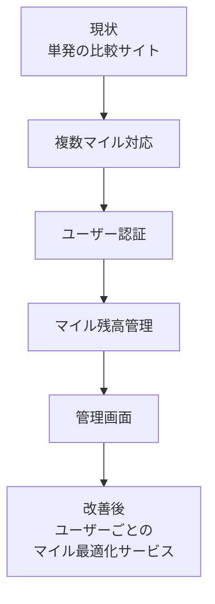

---

## ドキュメント別の見直しポイント

読者が元資料に戻って確認しやすいように、見直すべきドキュメントと観点を整理します。

| ドキュメント | 見直すべき内容 |
|---|---|
| `business-requirements.md` | 複数マイル対応、ユーザー認証、管理画面をサービス方針として明記する |
| `personas/*.md` | ANA/JAL合算などの表現を、マイルプログラム別管理に合わせて修正する |
| `journey.md` | 再訪・継続利用の流れに、ログイン・マイル残高管理を追加する |
| `specifications/P001-home.md` | 単一の保有マイル入力ではなく、ログインユーザーの保有マイル参照に変更する |
| `specifications/P002-compare-result.md` | BEST判定式、複数マイル別の比較表示、発券可否判定を定義する |
| `specifications/P003-airline-detail.md` | 比較結果と同一データバージョンを参照する仕様を追加する |
| `data-list.md` | `mileage_program`, `user_mile_balance`, `data_version` などを追加する |
| `database-design.md` | `users`, `mileage_programs`, `user_mile_balances`, `award_charts`, `admin_users` を追加する |
| `api-design.md` | 認証API、ユーザーマイルAPI、管理API、data_version指定、日次バッチの対象選定・失敗時方針を追加する |

---

## 推奨する設計方針

本サービスの価値は、単に航空会社ごとの燃油サーチャージを比較することではなく、ユーザーが持っているマイルを最も有効に使える選択肢を提示することにあります。

そのため、以下の方針を推奨します。

1. 複数マイルプログラム対応を前提にDB/APIを再設計する
2. ユーザー認証を導入し、ユーザーごとのマイル残高を保存できるようにする
3. 管理画面または運用コンソールを追加し、日次バッチの実行状況・取得失敗・表示制御を管理できるようにする
4. 「最もお得」の判定基準を明文化する
5. データ有効日・更新履歴・監査ログを設計に含める
6. 一般ユーザー、ログインユーザー、管理者の権限を分離する

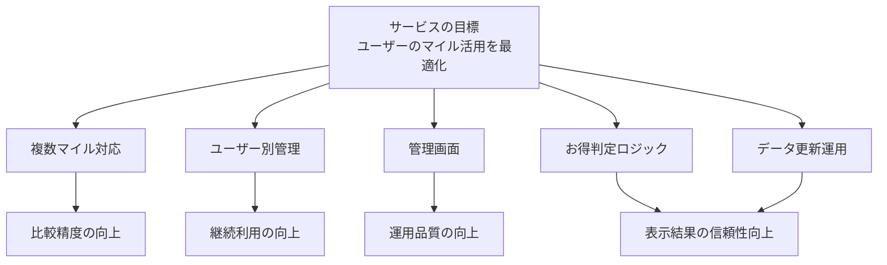

---

## 本レビュー指摘の位置づけ

本レビューの指摘は、個別の誤字・表現修正ではなく、設計全体の前提を確認するための指摘です。特に重要なのは、次の4つです。

| 指摘グループ | 対象課題 | 位置づけ |
|---|---|---|
| マイル制度の前提 | 課題1、課題3、課題10 | サービス価値の中心に関わるため、上流要件から見直すべき指摘 |
| 判断ロジック | 課題2、課題6 | 画面表示の信頼性に関わるため、仕様書・API設計で明文化すべき指摘 |
| 運用・データ鮮度 | 課題5、課題7、課題9 | リリース後の品質維持に関わるため、運用設計として追加すべき指摘 |
| セキュリティ・DB品質 | 課題8、課題11 | デプロイ前に必ず確認すべき、事故防止のための指摘 |

補足として、今後は指摘を個別に修正するだけではなく、**複数マイル対応・ユーザー認証・管理画面を前提に全体設計を再整理する** 方が効果的です。

---

## まとめ

現行設計は、マイル比較サービスの初期設計として一定の整理がされています。

しかし、実際のユーザー利用を想定すると、複数マイルの扱い、ユーザー別管理、管理画面、データ更新運用が不足しています。

このまま実装すると、以下のリスクがあります。

- 誤った発券可能判定を出す
- 比較結果の信頼性が下がる
- 再訪ユーザーにとって使いづらい
- データ更新が属人化する
- 管理・監査・セキュリティ面で運用負荷が高まる

したがって、今後は以下の方向性で設計を見直すことを推奨します。

```text
単発の比較サイト
ではなく、
ユーザーごとのマイル最適化サービス
として設計する
```

具体的には、複数マイルプログラム対応、ユーザー認証、ユーザー別マイル残高管理、管理画面を追加することで、比較精度・継続利用・運用品質を高めることができます。
